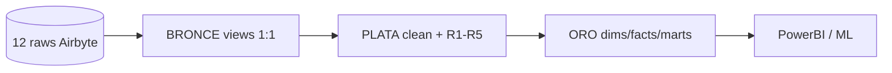

# Churn Telecom — Arquitectura Medallón en dbt (Snowflake)

> Exposición empresarial 10-15 min. Detalle técnico: `docs/informe_arquitectura_medallion.md`.

## 1. Problema de negocio

La telco pierde clientes sin saber por qué ni cuánto cuesta retenerlos: 12 fuentes Airbyte sucias
(CRM, contratos, facturación, pagos, consumo, red, soporte, marketing, churn, macro, metas, xref),
sin KPI único de fricción ni dataset ML. Preguntas sin respuesta: ¿quién se va en 90 días?,
¿a quién migrar de prepago a contrato?, ¿qué campaña sí retiene?

## 2. Solución: Medallón Bronce → Plata → Oro

| Capa | Carpeta | Schema | Materialización | Qué es y por qué así |
|---|---|---|---|---|
| **BRONCE** | `models/churn/01_staging/` (12 `stg_*` + `sources.yml`) | `DBT_STAGING` | `view` | **Espejo consultable del crudo.** Decidimos `view` 1:1 **porque** el crudo cambia a diario y no queremos copiar basura; solo depuración ligera (T1-T23). |
| **PLATA** | `models/churn/02_intermediate/` (11 `int_*_clean` + 5 `int_r*`) | `DBT_INTERMEDIATE` | `view` | **Dato confiable.** Decidimos `normalized → cleaned → dq_status` **porque** el negocio exige reglas (bilingüe, recálculos, futuros fuera). + `int_r3` cliente-mes e `int_r5` anti-leakage **para** fricción y ML. |
| **ORO** | `models/churn/03_marts/` (8 dims + 11 facts + 5 marts R1-R5) | `DBT_MARTS` | `table` + `incremental merge` | **Dato consumible.** Decidimos estrella con `surrogate_key` y `merge por source_extracted_at` **porque** PowerBI necesita joins rápidos y Snowflake barato (sin full refresh). |

Linaje: `source(raw_churn) → stg_* → int_*_clean → dim_*/fact_* → mart_r*`.
Fisicaliza el Medallón: `macros/generate_schema_name.sql:1-3` (el `schema=` del `config` va literal).



## 3. Por qué decidimos cada cosa (resumen para jurado)

- **Dedup `row_number() ... _airbyte_extracted_at desc` en Bronce** — porque Airbyte duplica; para no inflar `COUNT DISTINCT` de churn.
- **`upper(trim())` + `trim(pk)`** — porque `La Paz ≠ LA PAZ` partía `GROUP BY region` en 3 y `'C001 '` rompía joins CRM↔billing.
- **`greatest(coalesce(x,0),0)`** — porque sensores mandan `-3 GB`; para no restar consumo en `mart_r3_friction`.
- **`try_to_timestamp_ntz` + `try_to_decimal(regexp_replace(...))`** — porque un `'N/A'` o `'BOB 1,200'` tumbaba todo el `dbt run`; para tolerar Excel comercial y telemetría rota.
- **`sha2(msisdn)`** — porque el teléfono no puede bajar a PowerBI/ML; para privacidad sin perder trazabilidad.
- **Recálculo `total = base+...+tax-discount` + `dq_status` en Plata** (`int_billing_clean.sql:48-91`) — porque la factura cruda no cuadra; para KPI auditado.
- **Anti-leakage `label_churn_next_90d` + `WHERE churn_date > observation`** (`int_r5_ml_features.sql:33-40`) — porque el modelo no puede ver el futuro; para dataset ML honesto.
- **Incremental `merge` en facts** (`fact_billing.sql:39-47`) — porque full refresh ×10 costo; para ingesta diaria barata.

Detalle con antes/después por tratamiento (T1-T23): ver informe §3.1-3.2b.

## 4. Valor: qué responde cada mart Oro

| Mart | Pregunta negocio | Salida |
|---|---|---|
| `mart_r1_churn_early` | ¿Dónde se van en los primeros 12 meses? | `churn_rate_pct` por región/segmento |
| `mart_r2_contract_opportunity` | ¿A quién migrar a contrato? | `OFFER_TWO_YEAR / ONE_YEAR / NURTURE` |
| `mart_r3_friction` | ¿Cuánta fricción tiene cada cliente-mes? | `friction_score` (billing+cobranza+red+soporte) |
| `mart_r4_campaigns` | ¿Qué campaña sí retiene y a qué costo? | `acceptance_rate`, `retention_90_pct`, `net_value` |
| `mart_r5_crispdm_dataset` | ¿Quién se irá en 90 días? | dataset ML binario sin fuga |

## 5. Cómo reproducir (demo)

```bash
dbt build --select staging intermediate marts
dbt test
```

Fuentes y freshness: `models/churn/01_staging/sources.yml` (`24h` general, `45d` macro/metas, `7d` xref).
Calidad: `models/churn/schema.yml` (`not_null`, `unique`, `accepted_values [0,1]`, `relationships`, `between 18-120`).

## 6. Deuda honesta / roadmap

1. `int_r1..r4` leen `stg_*` directo (prototipo rápido) — migrar a `int_*_clean` para heredar DQ.
2. 2 filtros Bronce dropean (`stg_network_quality.sql:23`, `stg_support_tickets.sql:20`) — pasar a flag + descarte en Silver.
