# Informe dbt — Arquitectura Medallón Pura (Bronce → Plata → Oro)

**Proyecto:** `dbt_managment` (`my_new_project`, `dbt_project.yml:5`)
**Dominio:** churn telecom (12 fuentes) + legacy TPCH demo (fuera de alcance: `models/staging/`, `models/marts/order_item.sql`).
**Fecha:** 2026-09-29 — supersede informe 2026-09-26 (pre-PR #4). Revisión estricta 2026-09-29 (11 citas corregidas + deudas vivas admitidas).
**Refactor verificado:** `50432dd Merge PR #4 refactor architecture medallon` — Bronce adelgazado a `SELECT *`, Silver engordado con `deep_cleaning`, `int_r*` re-apuntados de `stg_*` a `int_*_clean`, nuevo `int_xref_customer_clean`.
**Archivos analizados:** `models/churn/01_staging/` (12 `stg_*` + `sources.yml`), `models/churn/02_intermediate/` (12 `int_*_clean` + 5 `int_r*`), `models/churn/03_marts/` (8 dims + 11 facts + 5 marts), `models/churn/schema.yml`, `macros/`, `dbt_project.yml`.

## §0 Cómo exponerlo en 10-15 min (guion empresarial)

1. **Min 0-2 Problema:** churn sin KPI único, 12 fuentes Airbyte sucias → preguntas R1-R5 sin respuesta.
2. **Min 2-4 Solución:** Medallón puro `BRONCE réplica RAW (view SELECT *) → PLATA dato confiable (view dedup+tipado+DQ) → ORO dato consumible (table / incremental merge)` → PowerBI/ML.
3. **Min 4-10 Decisiones:** 1 ejemplo por capa: Bronce `select *` auditable (`stg_crm_customers.sql:1-6`), Plata `total recalculado + billing_dq_status` (`int_billing_clean.sql:86-90,124-129`), Oro `label anti-leakage + merge por source_extracted_at` (`int_r5_ml_features.sql:33-40`, `fact_billing.sql:39-46`).
4. **Min 10-13 Valor:** 5 marts (tasa early-churn, ofertas contrato, `friction_score`, ROI campaña, dataset ML).
5. **Min 13-15 Cierre honesto:** deuda de linaje R-sobre-stg cerrada; deudas vivas admitidas: xref sin consumo, snapshot sin filtro incremental, `dim_date` huérfana, SCD1 simulado (§8). Ver §7-§8.

### Tabla decisión → alternativa descartada → por qué

| Decisión tomada | Alternativa descartada | Por qué la tomada |
|---|---|---|
| Bronce `view SELECT *` puro, tags `bronze,raw` | Bronce con `trim/dedup/try_to_*/sha2` | Réplica auditable; permite re-procesar Silver sin re-ingerir; cero riesgo de perder crudo |
| Dedup + filtros en Silver (`qualify row_number() ... _airbyte_extracted_at desc`) | Dedup en Bronce | Airbyte versiona filas; la regla de supervivencia es negocio (última foto), no formato |
| `int_r1..r5` leen solo `int_*_clean` | `int_r*` directo a `stg_*` (prototipo viejo) | Heredan tipado, capping, `dq_status`; un `'N/A'` o `-3 GB` ya llega saneado |
| Marcar + filtrar en Silver (`*_dq_status` + `where` final) | Dropear silencioso en Bronce | Negocio necesita saber *por qué* (`TOTAL_MISMATCH_REVIEW`, `FUTURE_TO_EXCLUDE`) y auditar |
| Plata `view` con `bronze_prepared → normalized → cleaned` | Plata `table` | Silver persiste regla, no dato; Oro congela consumo en `table/incremental` (costo real ahí) |
| Oro dims `table` + 10/11 facts `incremental merge` | Todo `table` full refresh | `merge por source_extracted_at` abarata ingesta diaria; excepción `fact_customer_month_snapshot` (§8 D4) |
| `generate_surrogate_key abs(hash(...))` | PKs naturales en facts | Naturales cambian/espacios; surrogate estabiliza joins PowerBI |
| `int_r5` anti-leakage (`observation_date + WHERE churn_date > observation`) | Label sin filtro temporal | Sin filtro el modelo ve el futuro y miente |

## Resumen ejecutivo

Medallón puro en 3 schemas físicos Snowflake:

| Capa Medallón | Carpeta dbt | Schema (via `config(schema=...)` + macro) | Materialización | Grano |
|---|---|---|---|---|
| **Bronce (réplica RAW)** | `models/churn/01_staging/` | `DBT_STAGING` | `view` | 1:1 con raw Airbyte, con duplicados y valores originales |
| **Plata-clean (dato confiable)** | `models/churn/02_intermediate/` `int_*_clean` (12) | `DBT_INTERMEDIATE` | `view` | 1:1 por dominio, deduplicado, tipado, con `*_dq_status` |
| **Plata-analítica (Hefesto / CRISP-DM)** | `models/churn/02_intermediate/` `int_r*` (5) | `DBT_INTERMEDIATE` | `view` | analítico (cliente, cliente-mes, interacción) solo sobre Silver |
| **Oro (consumo BI/ML)** | `models/churn/03_marts/` | `DBT_MARTS` | `table` (dims/marts), `incremental merge` (facts) | estrella + marts R1–R5 |

Regla de linaje: `source(raw_churn) → stg_* (SELECT *) → int_*_clean → int_r* → dim_*/fact_* → mart_r*`, con 2 matices documentados: `dim_date` es calendario independiente sin fuente raw; `int_xref_customer_clean` existe pero hoy ningún modelo Oro lo consume (§8 D2).

---

## 1. Diagrama de linaje

```mermaid
flowchart TB
    subgraph RAW["RAW (Snowflake via Airbyte)"]
        R1[(crm_customers)]
        R2[(subscriptions_contracts)]
        R3[(billing_invoices)]
        R4[(payments)]
        R5[(service_usage)]
        R6[(network_quality)]
        R7[(support_tickets)]
        R8[(marketing_retention)]
        R9[(churn_labels)]
        R10[(macro_monthly)]
        R11[(metas_retencion_region_mes)]
        R12[(xref_customer_id)]
    end
    subgraph BRONZE["BRONCE — DBT_STAGING (view SELECT *)"]
        S1[stg_crm_customers]
        S2[stg_subscriptions_contracts]
        S3[stg_billing_invoices]
        S4[stg_payments]
        S5[stg_service_usage]
        S6[stg_network_quality]
        S7[stg_support_tickets]
        S8[stg_marketing_retention]
        S9[stg_churn_labels]
        S10[stg_macro_monthly]
        S11[stg_metas_retencion_region_mes]
        S12[stg_xref_customer_id]
    end
    subgraph SILVER["PLATA-CLEAN — DBT_INTERMEDIATE (view)"]
        C1[int_customer_clean]
        C2[int_subscription_clean]
        C3[int_billing_clean]
        C4[int_payment_clean]
        C5[int_usage_clean]
        C6[int_network_clean]
        C7[int_support_clean]
        C8[int_marketing_clean]
        C9[int_churn_clean]
        C10[int_macro_clean]
        C11[int_retention_target_clean]
        C12[int_xref_customer_clean<br/>sin consumo en Oro]
    end
    subgraph INTER["PLATA-ANALITICA — DBT_INTERMEDIATE (view)"]
        R1M[int_r1_early_churn]
        R2M[int_r2_contract_opportunity]
        R3M[int_r3_friction_monthly]
        R4M[int_r4_campaign_effectiveness]
        R5M[int_r5_ml_features]
    end
    subgraph GOLD["ORO — DBT_MARTS (table / incremental)"]
        D[8 dims: customer, subscription, date*, plan, region, campaign, agent_team, network_node]
        F[11 facts: churn, subscription, usage, billing, payment, support, marketing, network, macro, retention_target, customer_month_snapshot**]
        M1[mart_r1_churn_early]
        M2[mart_r2_contract_opportunity]
        M3[mart_r3_friction]
        M4[mart_r4_campaigns]
        M5[mart_r5_crispdm_dataset]
    end
    R1 --> S1 --> C1 --> R1M & R2M & R3M & R4M & R5M
    R2 --> S2 --> C2 --> R1M & R2M & R5M
    R3 --> S3 --> C3 --> R3M
    R4 --> S4 --> C4 --> R3M
    R5 --> S5 --> C5 --> R3M
    R6 --> S6 --> C6 --> R3M
    R7 --> S7 --> C7 --> R3M
    R8 --> S8 --> C8 --> R4M
    R9 --> S9 --> C9 --> R1M & R2M & R5M
    R10 --> S10 --> C10 --> R5M
    R11 --> S11 --> C11 --> F
    R12 --> S12 --> C12
    R1M --> M1
    R2M --> M2
    R3M --> M3 & R5M --> M5
    R4M --> M4
    C1 & C2 & C3 & C4 & C5 & C6 & C7 & C8 & C9 --> D & F
    C10 --> R5M & F
```



`*` `dim_date` es independiente: `dim_date.sql:2` calendario `GENERATOR ROWCOUNT 7305` desde `2015-01-01`, sin `ref/source`, sin `relationships` a facts.
`**` `fact_customer_month_snapshot.sql:1-2` declara `incremental merge` pero sin bloque `is_incremental() WHERE source_extracted_at`; regenera historial cada run (ver §8 D4).

---

## 2. Configuración global

* `dbt_project.yml:38-44` — define `my_new_project.marts:+materialized: table` y `staging:+materialized: view` como fallback. **No gobierna `churn/`**: todo `churn/` fija su propio `config()` explícito. (Nota: no existe `models/example/`; el legado TPCH real es `models/staging/` + `models/marts/order_item.sql`.)
* `macros/generate_schema_name.sql:1-3`:
  ```sql
  {{ custom_schema_name if custom_schema_name is not none else target.schema }}
  ```
  Efecto: `schema='DBT_STAGING'` va literal a `DBT_STAGING` (sin prefijo `target.schema_`). Igual para `DBT_INTERMEDIATE` y `DBT_MARTS`. Es lo que fisicaliza el Medallón.
* Patrón Bronce (12/12 idéntico en lógica; 11/12 con 6 líneas, `stg_xref_customer_id` con 5): `{{ config(materialized='view', schema='DBT_STAGING', tags=['bronze','raw']) }}` — ej. `stg_crm_customers.sql:1`.
* Patrón Plata-clean (12/12 en `silver,deep_cleaning`; tercer tag varía): `{{ config(materialized='view', schema='DBT_INTERMEDIATE', tags=['silver','deep_cleaning','<dominio>']) }}` — ej. `int_customer_clean.sql:1` (`customer`), `int_billing_clean.sql:1` (`billing`), `int_network_clean.sql:1` (`network`); variantes: `int_subscription_clean` (`subscriptions` plural), `int_payment_clean` (`payments` plural), `int_retention_target_clean` (`retention_targets` plural), `int_xref_customer_clean.sql:1` (`customer_xref`).
* Patrón Plata-analítica (5/5): `{{ config(materialized='view', schema='DBT_INTERMEDIATE', tags=['intermediate','hefesto','rN']) }}` — ej. `int_r1_early_churn.sql:1`, `int_r3_friction_monthly.sql:1`; excepción R5 `tags=['intermediate','crisp_dm','r5','anti_leakage']` (`int_r5_ml_features.sql:1`).
* Patrón Oro dim: `{{ config(materialized='table',schema='DBT_MARTS',tags=['gold','dimension']) }}` — ej. `dim_customer.sql:1`.
* Patrón Oro fact (10/11): `{{ config(materialized='incremental',schema='DBT_MARTS',unique_key='billing_key',incremental_strategy='merge',on_schema_change='sync_all_columns',tags=['gold','fact']) }}` — ej. `fact_billing.sql:1`. Excepción `fact_customer_month_snapshot.sql:1` (`unique_key='customer_month_key'`, `tags=['gold','fact','snapshot']`, sin `on_schema_change`).
* Patrón Mart: `{{ config(materialized='table', schema='DBT_MARTS', tags=['mart','kimball','rN','powerbi']) }}` — ej. `mart_r3_friction.sql:1`, `mart_r4_campaigns.sql:1`; R5 `tags=['mart','crisp_dm','r5','anti_leakage','ml']` (`mart_r5_crispdm_dataset.sql:1`).

---

## 3. Capa BRONCE — réplica RAW (`01_staging`)

Filosofía actual: **no limpiar, no tipar, no deduplicar. Solo espejo consultable + trazabilidad.**

Patrón único, ejemplo `stg_crm_customers.sql:1-6` (11/12 con este formato; `stg_xref_customer_id.sql:1-5` con comentario de 1 línea):
```sql
{{ config(materialized='view', schema='DBT_STAGING', tags=['bronze','raw']) }}
-- Bronze: replica logica RAW; conserva columnas, valores, duplicados y metadatos.
-- La limpieza, el tipado y las validaciones se aplican en Silver.
select *
from {{ source('raw_churn','crm_customers') }}
```
Verificado: 12/12 `select *` sin `where/trim/try_to/sha2/join/group by`.

| Raw Airbyte | Stg view | Qué conserva y por qué (Silver lo resuelve) |
|---|---|---|
| `crm_customers` | `stg_crm_customers` | duplicados, `msisdn` en claro, `age=999`, `_airbyte_*`; Silver hashea (`sha2`) y filtra `18-120` |
| `subscriptions_contracts` | `stg_subscriptions_contracts` | flags `0/1/NULL`, `previous_plan=''`; Silver booleaniza |
| `billing_invoices` | `stg_billing_invoices` | `total=-20`, fechas crudas; Silver recalcula total y deriva `year_month` |
| `payments` | `stg_payments` | `days_late=-5`; Silver aplica `greatest(...,0)` |
| `service_usage` | `stg_service_usage` | `data_download_gb=-3.2`; Silver corrige a `0` |
| `network_quality` | `stg_network_quality` | `timestamp='N/A'`, borrados CDC vivos; Silver `try_to_*` + `_ab_cdc_deleted_at is null` |
| `support_tickets` | `stg_support_tickets` | `resolved_at` DATE o VARCHAR; Silver `to_varchar()` |
| `marketing_retention` | `stg_marketing_retention` | `accepted=NULL`, `campaign_cost=NULL`; Silver imputa |
| `churn_labels` | `stg_churn_labels` | `churned=2/'Y'`; Silver fuerza `churned in (0,1)` |
| `macro_monthly` | `stg_macro_monthly` | `'2024-13'`, `desempleo_pct`; Silver regex + ES→EN |
| `metas_retencion_region_mes` | `stg_metas_retencion_region_mes` | `'BOB 1,200.50'`; Silver `regexp_replace` |
| `xref_customer_id` | `stg_xref_customer_id` | puente `account↔customer` duplicado; Silver dedup compuesta |

Fuentes: `models/churn/01_staging/sources.yml:3-201` — `source: raw_churn`, `database: AIRBYTE_DATABASE`, `schema: AIRBYTE_SCHEMA`, `loaded_at_field: _airbyte_extracted_at`. Freshness 24h en 9 tablas (`sources.yml:14,28,46,66,86,100,116,136,152`), `45d` macro (`sources.yml:170`) y metas (`sources.yml:182`), `7d` xref (`sources.yml:197-198`).

Por qué así: si Bronce filtrara, se pierde auditoría y no se puede re-procesar Silver sin re-ingerir. El costo de `view SELECT *` es nulo en Snowflake.

---

## 4. Capa PLATA (`02_intermediate`)

### 4.1 `int_*_clean` — limpieza profunda (Silver real, 12 modelos)

Patrón `bronze_prepared (source_data → deduplicated → select tipado) → normalized → cleaned/reconciled → select + QUALIFY`. Sin `GROUP BY` en Silver-clean. Sin joins entre dominios, con **una excepción justificada**: `int_churn_clean.sql:46 LEFT JOIN int_customer_clean` para validar existencia y recalcular `tenure = datediff(month, registration_date, churn_date)` (`int_churn_clean.sql:38-46`).

Ejemplo `int_customer_clean.sql:4-34,35-65,66-123`: dedup `where nullif(trim(customer_id),'') is not null and age between 18 and 120 qualify row_number() over (partition by trim(customer_id) order by _airbyte_extracted_at desc ...) = 1` (`:10-15`), luego `sha2(msisdn)` (`:19`), mapeo bilingüe `case ... M/MASCULINO/HOMBRE → MALE` (`:40-45`), `senior = age>=65` (`:70`), flags `dependents_dq_status / registration_date_dq_status / senior_dq_status` (`:91-105`), `age_band` (`:106-113`), `customer_tenure_months` (`:114`), filtro final futuros fuera (`:120-123`).

Ejemplo recálculo `int_billing_clean.sql:4-40,83-92,93-135`: `reconciled` con `total_amount_recalculated = base+service+equipment+extra+tax-discount` (`:86-90`), luego `SELECT` con `amount_variance` (`:112`), flags `dq_valid_dates / dq_nonnegative_total / dq_total_match` (`:121-123`) y `billing_dq_status (VALID / TOTAL_MISMATCH_REVIEW / INVALID_DUE_DATE_TO_NULL / TOTAL_IMPUTED_ZERO)` (`:124-129`), `QUALIFY` final (`:135`).

Resumen por dominio:

| Silver | Lee de | Dedup / filtro clave | Tipado / regla negocio | DQ emitido |
|---|---|---|---|---|
| `int_customer_clean` | `stg_crm_customers` | PK + `age 18-120`, futuros fuera (`:120-123`) | `sha2(msisdn)`, bilingüe género/estado civil, `senior=age>=65` | `dependents/registration/senior_dq_status`, `age_band` |
| `int_subscription_clean` | `stg_subscriptions_contracts` | `subscription_id`, exige `customer_id` + fechas | 10 flags `0/1→boolean`, `UPPER` estados | secuencia contractual |
| `int_billing_clean` | `stg_billing_invoices` | `invoice_id` (`:13-16`), `issue_date not null`, `total>=0` | `year_month` (`:25`), `NUMBER(18,2/4)`, recálculo total | `billing_dq_status`, `amount_variance` |
| `int_payment_clean` | `stg_payments` | `payment_id` | `greatest(...,0)` mora/saldos, tolerancia sobrepago | `payment_friction_count` |
| `int_usage_clean` | `stg_service_usage` | `usage_id` | 10 métricas `greatest(...,0)`, capping streaming, reconciliación peak/offpeak | calidad registro |
| `int_network_clean` | `stg_network_quality` | `event_id` + CDC `_ab_cdc_deleted_at is null` (`:8-10`), `try_to_timestamp is not null` (`:26`) | `try_to_boolean`, capping latencia/jitter/pérdida, bandas `OUTAGE_OR_DROP/DEGRADED/WEAK_SIGNAL/NORMAL` (`:89-94`) | `network_dq_status` (`:79-88`), `dq_valid_*` (`:95-97`), filtro futuros (`:103-104`) |
| `int_support_clean` | `stg_support_tickets` | `ticket_id` + CDC (`:8`), `try_to_timestamp(created_at) is not null` (`:23`) | `to_varchar(resolved_at)` (`:15`), SLA por prioridad (`:117-123`), clasificación `LIKE CANCEL/BILL/NETWORK` (`:86-94`) | `support/satisfaction_dq_status` (`:100-116`), `sla_status`, filtro futuros (`:129-130`) |
| `int_marketing_clean` | `stg_marketing_retention` | `interaction_id` | `coalesce(bool,false)`, monotonicidad `retained_90→60→30`, ROI | corrección monotonicidad |
| `int_churn_clean` | `stg_churn_labels` | `customer_id`, `churned in (0,1)` (`:10-11`), solo `churned=1` (`:36`), futuros fuera (`:96-98`) | label binario, `tenure_recalculated` vía join customer (`:42-44`), categorías `PRICE/NETWORK_QUALITY/...` (`:55-66`) | `churn_dq_status` (`:78-88`), `dq_churn_after_registration` (`:76`) |
| `int_macro_clean` | `stg_macro_monthly` | `year_month` regex `YYYY-MM` | renombre ES→EN, rangos | período válido |
| `int_retention_target_clean` | `stg_metas_retencion_region_mes` | `target_id` | `regexp_replace` moneda/%, `LEAST(retained,active_base)` | rangos |
| `int_xref_customer_clean.sql:1-18` | `stg_xref_customer_id` | compuesta `account_id, customer_id` (`:15-18`), exige ambas no nulas (`:13-14`) | `upper(source_crm/billing)` | claves válidas — hoy sin consumo en Oro (§8 D2) |

### 4.2 `int_r*` — intermedio analítico (5 modelos, 100% sobre Silver)

Verificado: cero `ref('stg_*')` en los 5 `int_r*.sql` (el único `ref('stg_*')` con glob similar es `int_retention_target_clean.sql:6`, que no es R).

| Modelo | Inputs Silver | Grano / lógica |
|---|---|---|
| `int_r1_early_churn.sql:18-25` | `int_customer_clean`, `int_subscription_clean` (`:21-22`), `int_churn_clean` (`:23`) | cliente, cohorte `iff(... between 0 and 12) as is_first_12_months` (`:18-20`), `where ... between 0 and 12` (`:24-25`) |
| `int_r2_contract_opportunity.sql:15-24` | idem (`:21-23`) | cliente, `CASE 15-20 → NO_ACTION_CHURNED / HIGH(≥12m) / MEDIUM(≥6m) / LOW`, `where contract_type='MONTH_TO_MONTH'` (`:24`) |
| `int_r3_friction_monthly.sql:3-76` | `int_billing_clean` (`:7`), `int_payment_clean`+`int_billing_clean` (`:15-16`), `int_usage_clean` (`:23`), `int_network_clean` (`:32`), `int_support_clean` (`:40`), `int_customer_clean` (`:70`) | cliente-mes: 5 CTEs `GROUP BY customer_id, DATE_TRUNC('month',...)` + `spine UNION` (`:43-49`) + `LEFT JOIN` (`:71-75`) + `COALESCE(...,0)` (`:55-68`) |
| `int_r4_campaign_effectiveness.sql:25-28` | `int_marketing_clean` (`:26`), `int_customer_clean` (`:27`) | interacción: `estimated_net_value = IFF(accepted, value-cost, -cost)` (`:25`) |
| `int_r5_ml_features.sql:4,13,26-40` | `int_subscription_clean` (`:4`), `int_r3_friction_monthly` (`:26`), `int_customer_clean` (`:27`), `int_macro_clean` (`:29`), `int_churn_clean` (`:39`) | cliente-mes ML: `observation_date = LAST_DAY(month_start)` (`:13`), `label_churn_next_90d = IFF(churn_date > obs AND <= obs+90d)` (`:33-37`), `WHERE churn_date IS NULL OR > obs` anti-leakage (`:40`) |

---

## 5. Capa ORO (`03_marts`)

### 5.1 Dimensiones (8, `table`)
Patrón `dim_customer.sql:1-2`: `generate_surrogate_key(['customer_id']) as customer_key` + `SELECT` desde Silver + `source_extracted_at as effective_from, true as is_current` (flag literal, **no SCD real**: sin historia, sin `dbt_valid_from/to`, sin snapshots — ver §8 D5). Macro `macros/churn_utils.sql:1-3` (`abs(hash(coalesce(cast(...),'_dbt_null_')))`). Completan `dim_subscription`, `dim_date` (independiente, calendario `dim_date.sql:2`), `dim_plan` (`GROUP BY plan_name,tier`), `dim_region`, `dim_campaign` (`QUALIFY ROW_NUMBER`), `dim_agent_team` (`DISTINCT`), `dim_network_node` (`GROUP BY`).

### 5.2 Hechos (11, `incremental merge`; 10/11 con filtro, 1 excepción)
Patrón `fact_billing.sql:1-47`: surrogate keys (`billing/customer/subscription/plan/region_key` `:3-7`), `issue_date_key = TO_NUMBER(TO_CHAR(issue_date,'YYYYMMDD'))` (`:8`), `due_date_key` (`:9-11`), `1 AS invoice_count` (`:29`), flags DQ heredados (`:30-32`), `LEFT JOIN int_subscription_clean` (`:37`) / `int_customer_clean` (`:38`), filtro incremental ` WHERE source_extracted_at > (SELECT MAX(...) FROM {{this}})` (`:39-46`). **Nota de precisión:** `amount_variance::number(38,0)` (`:25`) trunca a entero una varianza `NUMBER(18,2)` — desvío `0.04` se vuelve `0` (§8 D5).
Mismo patrón con filtro en `fact_churn_event`, `fact_subscription_event`, `fact_usage_snapshot`, `fact_payment`, `fact_support_ticket`, `fact_marketing_interaction`, `fact_network_event`, `fact_macro_monthly`, `fact_retention_target_monthly`.
Excepción `fact_customer_month_snapshot.sql:1-2`: `incremental merge` con `unique_key='customer_month_key'` pero **sin** `on_schema_change` y **sin** bloque `is_incremental()`; construye `months FROM dim_date WHERE day_of_month=1 JOIN int_subscription_clean ON month BETWEEN start AND coalesce(end,current)` + `QUALIFY row_number` — regenera todo el historial cada run (§8 D4).

### 5.3 Marts R1–R5 (5, `table`, listos PowerBI/ML)
| Mart | Fuente | Lógica |
|---|---|---|
| `mart_r1_churn_early` | `int_r1_early_churn` | `GROUP BY region,segment`: `COUNT(DISTINCT customer)`, `churn_rate_pct`, `AVG(tenure)` |
| `mart_r2_contract_opportunity` | `int_r2_contract_opportunity` | `CASE priority → OFFER_TWO_YEAR / OFFER_ONE_YEAR / NURTURE / EXCLUDE` + `dbt_loaded_at` |
| `mart_r3_friction.sql:3-10` | `int_r3_friction_monthly` | `friction_score = SUM(4 flags: billing_amount_change>0, failed_payment_attempts>0, dropped_connections>0 OR outage_seconds>0, ticket_count>0)` (`:5-8`) + `dbt_loaded_at` (`:9`) |
| `mart_r4_campaigns.sql:3-21` | `int_r4_campaign_effectiveness` (`:20`) | `GROUP BY 1,2,3,4,5,6 = year_month,region,campaign_id,campaign_name,channel,offer_type` (`:4-9,:21`): `acceptance_rate_pct` (`:15`), `retention_90d_pct` (`:16`), `SUM(cost,net_value)` (`:17-18`) |
| `mart_r5_crispdm_dataset.sql:3-6` | `int_r5_ml_features` (`:6`) | `SELECT *, current_timestamp() as dbt_loaded_at` — dataset ML binario sin fuga |

---

## 6. Calidad y macros

* `models/churn/schema.yml` — Bronce solo `description` por diseño (11 modelos en `:4-35`, ej. `stg_billing_invoices: Bronze RAW... limpieza en int_billing_clean`, más `stg_xref_customer_id:327-328`); sin tests en Bronce porque debe conservar sucio.
* Silver/Oro (`schema.yml:37-326`): `not_null, unique` (ej. `schema.yml:40-42 customer_id`, `schema.yml:158-160 customer_key`), `relationships → int_customer_clean` (`schema.yml:69-72 int_churn`, `87-90 int_subscription`), `accepted_values` (`schema.yml:56-59 dependents DQ`, `309-314 label [0,1] quote:false`), custom `between` (`schema.yml:45-50 age 18-120`, `128-132 satisfaction 0-5`).
* `macros/churn_utils.sql:1-3` `generate_surrogate_key`, `:5-7` `normalize_boolean` (multilingüe ES/EN — definida, **0 usos** en `models/churn/`; Silver booleaniza inline con `coalesce/IFF/try_to_boolean`), `:9-11` test `between`.
* `macros/discounted_amount.sql` — solo demo TPCH, fuera de alcance churn.

---

## 7. Veredicto: ¿está bien lo que se hizo?

**Está bien. Ahora sí es Medallón puro: Bronce réplica, Silver decide, Oro consume.**

- **Bronce bien:** `SELECT *` se hizo **para** conservar auditoría y permitir replay de Silver. Si la limpieza siguiera aquí, se perdería el crudo y un `'N/A'` tumbaría el run antes de DQ.
- **Silver bien:** dedup `QUALIFY row_number`, tipado `NUMBER(18,2/4)`, `try_to_*`, `greatest(...,0)`, bilingüe, recálculo `total = base+...+tax-discount`, `dq_status`, capping y exclusión de futuros se hicieron **para** convertir dato consultable en confiable. Es el único lugar donde se filtra (salvo CDC heredado del raw).
- **Deudas del informe anterior — cerradas en PR #4:** `int_r1..r5` ya no leen `stg_*`; los filtros antes en Bronce ahora son Silver con `*_dq_status` + `where` final auditable (`int_network_clean.sql:26,103-104`, `int_support_clean.sql:23,129-130`).
- **Próximo paso:** `dbt build --select staging intermediate marts` + `dbt test` + `dbt source freshness` para validar freshness (`24h/45d/7d`) y `unique/not_null/relationships/between`.

---

## 8. Deudas vivas admitidas (para defensa honesta — no ocultar)

| # | Deuda | Evidencia | Impacto | Roadmap |
|---|---|---|---|---|
| D1 | Silver `view` en cascada costoso | 12 `int_*_clean` + 5 `int_r*` son `view`; `fact_billing.sql:37-38` recompila joins cada run | Costo Snowflake en Oro; fragilidad si Silver falla | Medir escaneo; materializar `int_billing/usage` a `table/incremental` si supera umbral |
| D2 | `int_xref_customer_clean` sin consumo | 0 `ref('int_xref_customer_clean')` en `03_marts`/`int_r*`; bien deduplicado en `int_xref_customer_clean.sql:15-18` | Puente `account↔customer` con freshness `7d` ingerido pero ignorado | Usar xref en `fact_billing.account_id` o retirar fuente del alcance |
| D3 | `dim_date` huérfana | `dim_date.sql:2` GENERATOR sin `ref`; 0 `relationships` a `dim_date` en `schema.yml` | Estrella sin FK testeada a calendario | Añadir `relationships` tests `*_date_key → dim_date` |
| D4 | `fact_customer_month_snapshot` incremental ficticio | `fact_customer_month_snapshot.sql:1-2` sin `is_incremental() WHERE source_extracted_at` | Full-scan meses×suscripciones cada run | Añadir filtro incremental real o migrar a `snapshot` dbt |
| D5 | SCD1 simulado + truncado + higiene | `dim_customer.sql:2` `true as is_current` literal; `fact_billing.sql:25 number(38,0)`; `_disabled_accidental_model`, `_legacy_accidental_macro`, `assert_discount_is_reasonable` TPCH | Sobrescritura de cambios, varianza `0.04→0`, ruido en repo | SCD2/snapshots, `number(18,2)` en varianza, limpiar legados y crear `assert_billing_variance` churn |

Frase de cierre para memorizar: *“Bronce réplica para auditar, Silver decide con DQ, Oro consume con merge; R5 no ve el futuro por `observation_date + WHERE > obs (int_r5_ml_features.sql:40)`; la deuda R-sobre-stg está cerrada, la deuda viva es xref sin uso y snapshot sin filtro incremental.”*

---

## Anexo A — referencias archivo:línea verificadas (2026-09-29)

* `models/churn/01_staging/sources.yml:3-201` (freshness 24h `:14,28,46,66,86,100,116,136,152`; `170` macro 45d; `182` metas 45d; `197-198` xref 7d)
* `stg_crm_customers.sql:1-6` (patrón Bronce; `stg_xref_customer_id.sql:1-5` variante 5 líneas)
* `macros/generate_schema_name.sql:1-3` · `macros/churn_utils.sql:1-11` · `dbt_project.yml:5,38-44`
* `int_customer_clean.sql:1,4-34,35-65,66-123` (género `:40-45`, senior `:70`, futuros `:120-123`) · `int_billing_clean.sql:1,4-40,83-92,93-135` (recálculo `:86-90`, varianza `:112`, DQ `:121-129`) · `int_network_clean.sql:1,8-10,26,79-105` · `int_support_clean.sql:1,8,23,86-94,100-131` · `int_churn_clean.sql:10-11,36,38-46,55-88,96-99` · `int_xref_customer_clean.sql:1-18`
* `int_r1_early_churn.sql:1,18-25` · `int_r2_contract_opportunity.sql:1,15-24` · `int_r3_friction_monthly.sql:1,3-76` (spine `:43-49`, coalesce `:55-68`, customer `:70`) · `int_r4_campaign_effectiveness.sql:1,25-28` · `int_r5_ml_features.sql:1,4,13,26-40`
* `dim_customer.sql:1-2` · `dim_date.sql:2` · `fact_billing.sql:1-47` (keys `:3-7`, fechas `:8-11`, incremental `:39-46`) · `fact_customer_month_snapshot.sql:1-2` · `mart_r3_friction.sql:1-10` · `mart_r4_campaigns.sql:1-21` · `mart_r5_crispdm_dataset.sql:1-6` · `models/churn/schema.yml:4-336`

## Anexo B — Glosario para estudiar (ES↔EN + negocio)

| Término | Qué es | Dónde verlo |
|---|---|---|
| `tenure` | meses desde `contract_start_date`/`registration_date` hasta churn o hoy | `int_r1.sql:18-20`, `int_churn_clean.sql:42-44,51-54` (`source` vs `recalculated`) |
| `cohorte` | grupo por antigüedad (0-12m early churn) | `int_r1.sql:24-25 between 0 and 12` |
| `fricción / friction_score` | 0-4: billing+cobranza+red+soporte en el mes | `mart_r3_friction.sql:5-8` |
| `spine` | universo cliente-mes (`UNION` de 5 dominios) | `int_r3.sql:43-49` |
| `observation_date` | `LAST_DAY(month_start)`, punto de observación ML | `int_r5.sql:13` |
| `label_churn_next_90d` | `1` si `churn_date` en `(obs, obs+90d]` | `int_r5.sql:33-37`, test `schema.yml:309-314` |
| `surrogate key` | `abs(hash(...))` estable, nulo-seguro | `churn_utils.sql:1-3`, `fact_billing.sql:3-7` |
| `SCD1 (simulado)` | `true as is_current`, sobrescribe sin historia | `dim_customer.sql:2` (§8 D5) |
| `merge incremental` | `WHERE source_extracted_at > MAX(...)` | `fact_billing.sql:39-46` (ausente en snapshot) |
| `CDC` | borrado lógico `_ab_cdc_deleted_at is null` (solo network/support) | `int_network_clean.sql:9`, `int_support_clean.sql:8` |
| `freshness` | `warn_after 24h/45d/7d` con `loaded_at_field` | `sources.yml:14,170,182,197-198` |
| `migration_priority` | `NO_ACTION_CHURNED/HIGH(≥12m)/MEDIUM(≥6m)/LOW` | `int_r2.sql:15-20` |
| `Hefesto / CRISP-DM` | tags plata-analítica; R5 anti-leakage para ML | `int_r1.sql:1`, `int_r5.sql:1` |

## Anexo C — Tabla DQ completa (marcar + filtrar, nunca dropeo silencioso en Bronce)

| Dominio | Columna DQ | Valores | Acción |
|---|---|---|---|
| customer | `dependents_dq_status` (`int_customer_clean.sql:91-96`, test `schema.yml:56-59`) | `VALID/IMPUTED_ZERO/CORRECTED_TO_ZERO/BOOLEAN_ALIGNED_TO_COUNT` | imputar/corregir, trazar |
| customer | `registration_date_dq_status` (`:97-101`) + filtro `:120-123` | `VALID/MISSING/FUTURE_TO_EXCLUDE` | excluir futuros |
| customer | `senior_dq_status` (`:102-105`) | `VALID/FLAG_ALIGNED_TO_AGE` | alinear a `age>=65` |
| billing | `billing_dq_status` (`:124-129`) + flags `:121-123` | `VALID/TOTAL_MISMATCH_REVIEW/INVALID_DUE_DATE_TO_NULL/TOTAL_IMPUTED_ZERO` | `due_date→NULL`, revisar descuadre `>0.05` (`:86-90`) |
| network | `network_dq_status` (`:79-88`) + `dq_valid_*` (`:95-97`) + filtro `:103-104` | `VALID/INVALID_TIMESTAMP/FUTURE_EVENT_EXCLUDED/NEGATIVE_METRIC_CORRECTED/...` | cappear, excluir futuros |
| support | `support_dq_status` (`:108-116`), `satisfaction_dq_status` (`:100-104`, test `:128-132`), `sla_status` (`:117-123`) + filtro `:129-130` | `VALID/.../SLA_BREACH/WITHIN_SLA` | `NULL` si `resolved<created`, excluir futuros |
| churn | `churn_dq_status` (`:78-88`), `dq_churn_after_registration` (`:76`) + filtro `:96-98` | `VALID/FUTURE_CHURN_EXCLUDED/CHURN_BEFORE_REGISTRATION_EXCLUDED/...` | excluir futuros/anteriores a registro |
| r5 | `label_churn_next_90d` (`schema.yml:309-314`) | `[0,1]` | binario anti-leakage (`int_r5.sql:40`) |

## Anexo D — Mapa de tests + comandos

| Qué | Dónde | Comando |
|---|---|---|
| `not_null, unique` PKs Silver/Oro | `schema.yml:40-42` (customer), `:64-72` (churn), `:158-160` (dim) | `dbt test --select int_customer_clean` |
| `relationships` Silver→Silver | `schema.yml:69-72` (churn→customer), `87-90` (subscription→customer) | `dbt test --select int_churn_clean` |
| `accepted_values` DQ + label | `schema.yml:56-59`, `309-314 quote:false` | `dbt test --select int_r5_ml_features` |
| custom `between` | `churn_utils.sql:9-11`; uso `schema.yml:45-50` (age), `128-132` (satisfaction) | `dbt test --select int_support_clean` |
| Bronce sin tests (diseño) | `schema.yml:4-35 + 327-328` solo `description` | — |
| Freshness Airbyte | `sources.yml:14` (24h×9), `:170` (45d), `:182` (45d), `:197-198` (7d) | `dbt source freshness` |
| Build total | — | `dbt build --select staging intermediate marts` + `dbt test` |

Si falla freshness 24h: revisar Airbyte (`_airbyte_extracted_at`), no el modelo. Si falla `unique`: revisar dedup `QUALIFY row_number` del Silver correspondiente.

## Anexo E — 10 preguntas de defensa + respuesta modelo + cita

1. **¿Por qué Silver es `view` y no `table`?** Persiste regla, no dato; Oro congela consumo. `int_customer_clean.sql:1` (view) vs `dim_customer.sql:1` (table) vs `fact_billing.sql:1` (incremental).
2. **¿`SELECT *` en Bronce no es vagancia?** Réplica auditable; permite replay sin re-ingerir; 12/12 sin `where`. `stg_crm_customers.sql:1-6` + `sources.yml:12`.
3. **¿Airbyte duplicando no duplica facturas?** Supervivencia `QUALIFY row_number() PARTITION pk ORDER BY _airbyte_extracted_at DESC`. `int_billing_clean.sql:13-16`, `int_customer_clean.sql:12-15`; CDC solo network/support (`int_network_clean.sql:9`).
4. **¿Cómo evitan fuga temporal?** `observation_date=LAST_DAY(month_start)` + `label IFF(churn>obs AND<=obs+90)` + `WHERE churn IS NULL OR >obs`. `int_r5_ml_features.sql:13,33-40`, tags `:1`.
5. **¿Por qué `abs(hash)` y no PK natural?** Naturales cambian/espacios; surrogate nulo-seguro. `churn_utils.sql:1-3`; uso `fact_billing.sql:3-7`, `dim_customer.sql:2`.
6. **¿El `merge` ahorra o miente?** Ahorra ingesta (`fact_billing.sql:39-46`) pero es insert-only por `MAX()`; snapshot no filtra (`fact_customer_month_snapshot.sql:1-2`) — full-scan admitido (§8 D4).
7. **¿Qué DQ hacen? Dame código.** Marcar+filtrar: `total_recalculated (:86-90)` + `TOTAL_MISMATCH_REVIEW (:124-129)`; `FUTURE_TO_EXCLUDE` + filtro (`int_customer_clean.sql:97-101,120-123`).
8. **¿Hefesto/CRISP-DM no es decoración?** Separa clean (regla) de R (negocio); R 100% sobre Silver, cero `ref('stg_*')` en R. `int_r1.sql:1,21-23`, `int_r3.sql:3-76`, `int_r4.sql:25`.
9. **¿`int_churn_clean` viola “Silver sin joins”?** Única excepción justificada: valida existencia + recalcula tenure, sin ciclo. `int_churn_clean.sql:38-46,96-99`.
10. **¿Bronce sin tests + `dbt_project.yml` muerto?** Diseño: Bronce solo `description` (`schema.yml:4-35,327-328`); tests en Silver/Oro. `dbt_project.yml:38-44` fallback; fisicaliza `generate_schema_name.sql:1-3`.
