# Informe dbt — Arquitectura Medallón (Bronce → Plata → Oro)

**Proyecto:** `dbt_managment` (`my_new_project`, `dbt_project.yml:5`)
**Dominio principal:** churn telecom (12 fuentes) + legacy TPCH demo (fuera de alcance de este informe por decisión de alcance).
**Fecha:** 2026-09-26
**Archivos analizados:** `models/churn/01_staging/` (12 `stg_*` + `sources.yml`), `models/churn/02_intermediate/` (11 `int_*_clean` + 5 `int_r*`), `models/churn/03_marts/` (8 dims + 11 facts + 5 marts), `models/churn/schema.yml`, `macros/`, `dbt_project.yml`.

## §0 Cómo exponerlo en 10-15 min (guion empresarial)

1. **Min 0-2 Problema:** churn sin KPI único, 12 fuentes sucias → preguntas R1-R5 sin respuesta.
2. **Min 2-4 Solución:** Medallón `DBT_STAGING (view 1:1) → DBT_INTERMEDIATE (view DQ) → DBT_MARTS (table/incremental)` → PowerBI/ML.
3. **Min 4-10 Decisiones:** Bronce-formato (T1-T23 para no tumbar el run) → Plata-negocio (recálculos + `dq_status` para confiar) → Oro-consumo (estrella + `merge` para rápido y barato). Citar 1 ejemplo por capa: `sha2(msisdn)`, `total recalculado`, `label anti-leakage`.
4. **Min 10-13 Valor:** demo de 5 marts (tasa early-churn, ofertas contrato, `friction_score`, ROI campaña, dataset ML).
5. **Min 13-15 Cierre honesto:** deuda R1-R4 + 2 filtros Bronce como roadmap. Ver §7.

### Tabla decisión → alternativa descartada → por qué

| Decisión tomada | Alternativa descartada | Por qué la tomada |
|---|---|---|
| Bronce `view` 1:1 + depuración ligera | Bronce `table` con negocio | `view` no copia basura diaria; negocio en Bronce pierde crudo auditable |
| Dedup por `_airbyte_extracted_at desc` | `DISTINCT` simple | Airbyte versiona; hay que quedarse con la última foto, no una arbitraria |
| `try_to_*` en Bronce | `CAST` directo | Un `'N/A'` con `CAST` aborta las 12 views; `try_to` degrada a NULL |
| `year_month` derivado en Bronce | Calcular en cada Mart | Un solo formato evita que joins `USING(year_month)` fallen por `YYYYMM` vs `YYYY-MM` |
| Plata `view` con `dq_status` | Filtrar silencioso | Negocio necesita saber *por qué* se corrigió (`TOTAL_MISMATCH_REVIEW`, `FUTURE_TO_EXCLUDE`) |
| Oro dims `table` + facts `incremental merge` | Todo `table` full refresh | `merge por source_extracted_at` abarata Snowflake ×10 en ingesta diaria |
| `surrogate_key abs(hash(...))` | PKs naturales en facts | Naturales cambian/espacios; surrogate estabiliza joins PowerBI |
| `int_r5` anti-leakage | Label sin filtro temporal | Sin `WHERE churn_date > observation` el modelo ve el futuro y miente |

## Resumen ejecutivo

Se implementó Medallón clásico en 3 schemas físicos Snowflake:

| Capa Medallón | Carpeta dbt | Schema (via `config(schema=...)` + macro) | Materialización | Grano |
|---|---|---|---|---|
| **Bronce (crudo + depuración ligera)** | `models/churn/01_staging/` | `DBT_STAGING` | `view` | 1:1 con raw Airbyte |
| **Plata (limpieza profunda + tipado)** | `models/churn/02_intermediate/` | `DBT_INTERMEDIATE` | `view` | 1:1 por dominio (`int_*_clean`) + grano analítico (`int_r*`) |
| **Oro (consumo BI/ML)** | `models/churn/03_marts/` | `DBT_MARTS` | `table` (dims/marts), `incremental merge` (facts) | estrella + marts R1–R5 |

Regla de oro del linaje: `source(raw_churn) → stg_* → int_*_clean → dim_*/fact_* → mart_r*`, con **una excepción documentada en §6**: `int_r1..r4` leen `stg_*` directo (deuda de linaje).

---

## 1. Diagrama de linaje

```mermaid
flowchart TB
    subgraph RAW["RAW (Snowflake via Airbyte)"]
        R1[(crm_customers)]
        R2[(subscriptions_contracts)]
        R3[(billing_invoices)]
        R4[(payments)]
        R5[(service_usage)]
        R6[(network_quality)]
        R7[(support_tickets)]
        R8[(marketing_retention)]
        R9[(churn_labels)]
        R10[(macro_monthly)]
        R11[(metas_retencion_region_mes)]
        R12[(xref_customer_id)]
    end
    subgraph BRONZE["BRONCE — DBT_STAGING (view)"]
        S1[stg_crm_customers]
        S2[stg_subscriptions_contracts]
        S3[stg_billing_invoices]
        S4[stg_payments]
        S5[stg_service_usage]
        S6[stg_network_quality]
        S7[stg_support_tickets]
        S8[stg_marketing_retention]
        S9[stg_churn_labels]
        S10[stg_macro_monthly]
        S11[stg_metas_retencion_region_mes]
        S12[stg_xref_customer_id]
    end
    subgraph SILVER["PLATA — DBT_INTERMEDIATE (view)"]
        C1[int_customer_clean]
        C2[int_subscription_clean]
        C3[int_billing_clean]
        C4[int_payment_clean]
        C5[int_usage_clean]
        C6[int_network_clean]
        C7[int_support_clean]
        C8[int_marketing_clean]
        C9[int_churn_clean]
        C10[int_macro_clean]
        C11[int_retention_target_clean]
        R1M[int_r1_early_churn]
        R2M[int_r2_contract_opportunity]
        R3M[int_r3_friction_monthly]
        R4M[int_r4_campaign_effectiveness]
        R5M[int_r5_ml_features]
    end
    subgraph GOLD["ORO — DBT_MARTS (table / incremental)"]
        D[8 dims: customer, subscription, date, plan, region, campaign, agent_team, network_node]
        F[11 facts: churn, subscription, usage, billing, payment, support, marketing, network, macro, retention_target, customer_month_snapshot]
        M1[mart_r1_churn_early]
        M2[mart_r2_contract_opportunity]
        M3[mart_r3_friction]
        M4[mart_r4_campaigns]
        M5[mart_r5_crispdm_dataset]
    end
    R1 --> S1 --> C1 --> D & F
    R2 --> S2 --> C2 --> D & F
    R3 --> S3 --> C3 --> F
    R4 --> S4 --> C4 --> F
    R5 --> S5 --> C5 --> F
    R6 --> S6 --> C6 --> D & F
    R7 --> S7 --> C7 --> D & F
    R8 --> S8 --> C8 --> D & F
    R9 --> S9 --> C9 --> F
    R10 --> S10 --> C10 --> F
    R11 --> S11 --> C11 --> F
    R12 --> S12
    S1 & S2 & S9 --> R1M --> M1
    S1 & S2 & S9 --> R2M --> M2
    S1 & S3 & S4 & S5 & S6 & S7 --> R3M --> M3
    S8 & S1 --> R4M --> M4
    R3M & S1 & S2 & S10 & S9 --> R5M --> M5
```



---

## 2. Configuración global

* `dbt_project.yml:38-44` — default `view`; override `marts → table`, `staging → view`. En la práctica cada modelo churn fija su propio `config()`, por lo que este bloque es solo fallback.
* `macros/generate_schema_name.sql:1-3`:
  ```sql
  {{ custom_schema_name if custom_schema_name is not none else target.schema }}
  ```
  Efecto: `schema='DBT_STAGING'` va literal a `DBT_STAGING` (sin prefijo `target.schema_`). Igual para `DBT_INTERMEDIATE` y `DBT_MARTS`. Es lo que fisicaliza el Medallón.
* Patrón Bronce (las 12 `stg`): `{{ config(materialized='view', schema='DBT_STAGING', tags=['staging','depuracion']) }}` — ej. `stg_crm_customers.sql:1`.
* Patrón Plata clean: `{{ config(materialized='view', schema='DBT_INTERMEDIATE', tags=['silver','deep_cleaning','<dominio>']) }}` — ej. `int_customer_clean.sql:1`, `int_billing_clean.sql:1`.
* Patrón Oro dim: `{{ config(materialized='table',schema='DBT_MARTS',tags=['gold','dimension']) }}` — ej. `dim_customer.sql:1`.
* Patrón Oro fact: `{{ config(materialized='incremental',schema='DBT_MARTS',unique_key='billing_key',incremental_strategy='merge',on_schema_change='sync_all_columns',tags=['gold','fact']) }}` — ej. `fact_billing.sql:1`.

---

## 3. Capa BRONCE — tratamiento de datos (sección principal)

Filosofía: **no inventar negocio, solo hacer el crudo consultable y trazable**. Todo Bronce comparte CTE `source_data → deduplicated → select` (salvo `stg_macro_monthly` y `stg_xref_customer_id` que hacen `select ... where ... qualify` directo) y conserva `_airbyte_extracted_at as source_extracted_at` en la última columna de cada `select`.

Declaración de fuentes: `models/churn/01_staging/sources.yml:4-7` define `source: raw_churn`, `database: AIRBYTE_DATABASE`, `schema: AIRBYTE_SCHEMA`, con `loaded_at_field: _airbyte_extracted_at` y freshness (`sources.yml:12-14` → `24h` general; `sources.yml:167-170,179-182` → `45 day` para `macro_monthly` y `metas_retencion_region_mes`; `sources.yml:195-198` → `7 day` para `xref_customer_id`).

### 3.1 Taxonomía completa de tratamientos aplicados en Bronce — qué se hizo y para qué

> Formato: **Problema del crudo → Tratamiento → Por qué (justificación) → Si no se hiciera → Dónde se consume**.

| # | Tratamiento (qué) | Por qué se hizo (para qué) | Si no se hiciera (riesgo) | Dónde se consume |
|---|---|---|---|---|
| T1 | Deduplicación última extracción: `qualify row_number() over (partition by trim(pk) order by _airbyte_extracted_at desc, ...)=1` — Los 12 | **Se hizo para** quedarse con la foto más reciente de Airbyte, que re-extrae y duplica PKs. Sin esto no hay `unique` posible. | Doble conteo en `mart_r1` (`COUNT DISTINCT` inflado), `dim_customer` viola `unique`, facts duplican ingresos. | `schema.yml:9 unique`, `dim_*`, `mart_r1_churn_early`, `fact_billing` merge |
| T2 | Filtro PK nula/vacía: `where nullif(trim(id),'') is not null` — Los 12 | **Se hizo para** eliminar filas sin identidad (`''`, `'   '`, NULL) que el CRM/facturación generan por cargas parciales. Sin identidad no hay join. | Joins `USING(customer_id)` generan NULOs huérfanos, `relationships` tests fallan, `fact_customer_month_snapshot` explota. | Todos los `int_*_clean`, `fact_*` |
| T3 | Filtro dominio: `age between 18-120`, `churned in (0,1)`, `total>=0` — crm, churn_labels, billing, payments | **Se hizo para** cortar valores imposibles en origen (edad 5 o 999, `churned=2`, factura `-50`). Es barato filtrar aquí y caro depurar en PowerBI. | `age_band` con `INVALID`, label ML con 3 clases en vez de binaria, KPIs con montos negativos. | `int_customer_clean.sql:88`, `int_r5_ml_features.sql:33-37 label`, `mart_r5` |
| T4 | Fecha obligatoria `is not null` — subscriptions, billing, usage, marketing | **Se hizo para** exigir el eje temporal mínimo (sin `issue_date` no hay `year_month`, sin `start_date` no hay tenure). | `DATE_TRUNC('month',NULL)` → mes NULL en `int_r3` spine, snapshots con huecos, `dim_date` sin match. | `int_r3_friction_monthly.sql:4,11,20`, `fact_customer_month_snapshot` |
| T5 | Soft-delete CDC `_ab_cdc_deleted_at is null` — network, support | **Se hizo para** respetar borrados lógicos del origen CDC. Airbyte no borra, marca. | Tickets/eventos eliminados resucitan en `fact_support_ticket` y `mart_r3_friction` (ticket_count inflado). | `fact_support_ticket`, `fact_network_event`, `mart_r3` |
| T6 | `upper(trim(col))` — 10 archivos | **Se hizo para** unificar variantes (`La Paz / LA PAZ / la paz `, `mensual / MENSUAL`). El `GROUP BY region` de Oro parte en 3 si no se normaliza. | `dim_region` con 3 filas por región, `mart_r1 GROUP BY region` triplicado, filtros PowerBI rotos. | `dim_region`, `dim_plan`, `mart_r1/r4 GROUP BY` |
| T7 | `initcap(trim(city/campaign_name))` — crm, marketing | **Se hizo para** dejar legible lo que ve negocio (`la paz → La Paz`) manteniendo unicidad visual. | Ciudades duplicadas en filtros y `dim_campaign` sucia para negocio. | `dim_customer.city`, `dim_campaign` |
| T8 | `trim(pk)` puro — todos | **Se hizo para** matar espacios fantasma (`'C001 '` vs `'C001'`) que rompen joins entre CRM y billing. | `LEFT JOIN USING(customer_id)` deja 10-20% huérfanos, `relationships` tests fallan. | Todos los joins Silver/Oro |
| T9 | Vacío → NULL `nullif(upper(trim(col)),'')` — previous_plan, collection_action, retention_reason, comment_text | **Se hizo para** distinguir "sin dato" (`''`) de "dato cero". `''` contamina `DISTINCT` y ML. | `COUNT(DISTINCT previous_plan)` cuenta `''` como plan, features ML con categoría fantasma. | `dim_subscription`, `int_r5_ml_features` |
| T10 | Nulo → 0 tipado `coalesce(x,0)::number` — billing, payments, usage, network, marketing, crm | **Se hizo para** que `SUM()` no propague NULL (un `NULL + 100 = NULL`) y para tipar Snowflake (`VARIANT → NUMBER(18,2)`). | `billed_amount` NULL en `int_r3`, `friction_score` NULL, PowerBI muestra blancos. | `int_r3_friction_monthly.sql:55-68 COALESCE`, `fact_*` |
| T11 | Anti-negativos `greatest(coalesce(x,0),0)` — precio, saldos, métricas uso, resolution, discount, tenure | **Se hizo para** corregir sensores/errores de carga (`data_download_gb=-3.2`, `days_late=-1`). Un consumo negativo no existe físicamente. | `SUM(data)` negativo, `AVG(latency)` distorsionado, `friction_score` con saldos negativos que ocultan mora. | `fact_usage_snapshot`, `fact_payment`, `mart_r3_friction` |
| T12 | Booleanización `iff(coalesce(col,0)=1,true,false)` — crm, subscriptions ×10, macro | **Se hizo para** pasar de `0/1/NULL` crudo a `BOOLEAN` analítico (`has_phone_service`, `tariff_shock`). BI filtra por boolean, no por int. | Filtros `WHERE has_internet` fallan con NULLs, `mart_r2` segmenta mal `MONTH_TO_MONTH`. | `dim_subscription`, `dim_customer`, `fact_macro_monthly` |
| T13 | Booleanización segura `coalesce(try_to_boolean(col),false)` — network, support, marketing | **Se hizo para** tolerar `'true'/'1'/'sí'/NULL` mezclados del origen sin tumbar la view. | `CAST('sí' AS BOOLEAN)` aborta el `dbt run` completo. | `fact_network_event`, `fact_support_ticket`, `fact_marketing_interaction` |
| T14 | Parsing seguro `try_to_timestamp_ntz(col)` — network, support, metas | **Se hizo para** convertir texto a timestamp sin abortar (`'N/A' → NULL` en vez de error). Es formato, no negocio, por eso va en Bronce. | Un solo `'N/A'` tumba las 12 views del `dbt run`. | `int_r3` (`DATE_TRUNC(event_timestamp)`), `fact_network_event` |
| T15 | Wrapping mixto `to_varchar()` antes de `try_to_*` — support | **Se hizo para** soportar que `resolved_at` llega a veces DATE y a veces VARCHAR según la extracción. | `try_to_timestamp_ntz(DATE)` falla por tipo; sin wrap, 50% de tickets se pierden. | `int_support_clean` (SLA `DATEDIFF`), `fact_support_ticket` |
| T16 | Validación mes `regexp_like(...,'^[0-9]{4}-(0[1-9]|1[0-2])$')` — macro, metas | **Se hizo para** rechazar `'2024-13'`, `'ene-2024'`, `'2024/01'` del Excel comercial antes de hacer `to_date`. | `to_date('2024-13-01')` → NULL silencioso que contamina `dim_date` join. | `dim_date`, `fact_macro_monthly`, `fact_retention_target_monthly` |
| T17 | Limpieza moneda `try_to_decimal(regexp_replace(col,'[^0-9.-]',''))` — metas (5 cols) | **Se hizo para** quitar `BOB`, comas, `%`, espacios (`'BOB 1,200.50' → 1200.50`). El área comercial carga Excel con formato. | `CAST('BOB 1,200' AS NUMBER)` aborta; metas quedan fuera y `retention_rate` no se calcula. | `int_retention_target_clean`, `fact_retention_target_monthly` |
| T18 | Derivado `to_char(fecha,'YYYY-MM') as year_month` — billing, payments, usage, network, support, marketing | **Se hizo para** tener la partición mensual lista sin re-calcular en cada Silver/Mart. Es el grano de `int_r3`. | Cada `int_r*` recalcula distinto (`YYYYMM` vs `YYYY-MM`) y los joins `USING(year_month)` con macro fallan. | `int_r3_friction_monthly`, `int_r5`, `fact_*` |
| T19 | Derivado `to_date(year_month||'-01') as month_start` — macro, metas | **Se hizo para** tener DATE real para joins con `dim_date` y `DATE_TRUNC`. `year_month` texto no joinea con DATE. | `JOIN dim_date ON year_month = ...` imposible; `fact_macro_monthly` sin `date_key`. | `dim_date`, `fact_macro_monthly` |
| T20 | Hash PII `sha2(coalesce(msisdn,''),256)` — crm | **Se hizo para** no bajar el teléfono en claro a Oro/PowerBI (GDPR/privacidad). Se conserva trazabilidad sin exponer. | MSISDN en claro en `dim_customer` → breach, el dataset ML `mart_r5` filtraría PII. | `int_customer_clean.sql:6 msisdn_hash`, `dim_customer`, `mart_r5` (sin PII) |
| T21 | Renombre ES→EN — macro, metas | **Se hizo para** unificar idioma del modelo (`desempleo→unemployment_pct`, `responsable→commercial_owner`). El resto del modelo está en EN. | ML/BI con `desempleo_pct` y `unemployment_pct` duplicados, confusión en `mart_r5`. | `int_macro_clean`, `int_r5_ml_features.sql:21-25` |
| T22 | Trazabilidad `source_extracted_at` — Los 12 | **Se hizo para** incremental (`WHERE source_extracted_at > MAX(...)` en 10/11 facts) y para dedup T1 y freshness. Sin esto no hay `merge`. | `fact_billing.sql:39-47` no puede hacer incremental → full refresh siempre, costo Snowflake ×10. | 10/11 `fact_*` con filtro (excepción `fact_customer_month_snapshot`), `sources.yml` freshness |
| T23 | Cast explícito `::integer / ::number(18,4)` — crm, billing, churn, macro | **Se hizo para** fijar precisión monetaria (`18,2`) y porcentual (`18,4`) desde Bronce. Evita `FLOAT` con errores de redondeo. | `SUM(total_amount)` con FLOAT → `100.10+200.20=300.30000000004`, `amount_variance` falso positivo. | `int_billing_clean.sql:74 amount_variance`, `fact_billing` |

### 3.2 Fichas por archivo (con referencia y código)

#### `models/churn/01_staging/stg_crm_customers.sql` — maestro clientes
Origen `source('raw_churn','crm_customers')` (`stg_crm_customers.sql:4`). Filtra edad inválida y PK vacía, dedup por cliente (`:8-13`):
```sql
where nullif(trim(customer_id),'') is not null
  and age between 18 and 120
qualify row_number() over (
    partition by trim(customer_id)
    order by _airbyte_extracted_at desc, _airbyte_generation_id desc
) = 1
```
Tratamientos: hash PII + booleanización + normalización texto + default UNKNOWN (`:17-29`):
```sql
sha2(coalesce(msisdn,''),256) as msisdn_hash,
upper(trim(gender)) as gender,
initcap(trim(city)) as city,
iff(coalesce(senior_citizen,0)=1,true,false) as is_senior_citizen,
coalesce(number_of_dependents,0)::integer as number_of_dependents,
coalesce(upper(trim(estimated_income_band)),'UNKNOWN') as estimated_income_band,
```

#### `models/churn/01_staging/stg_subscriptions_contracts.sql` — contratos
Dedup por suscripción + exige cliente y fecha inicio (`:7-13`):
```sql
where nullif(trim(subscription_id),'') is not null
  and nullif(trim(customer_id),'') is not null
  and contract_start_date is not null
qualify row_number() over (partition by trim(subscription_id) ...)
```
Normaliza 5 categóricos a UPPER y convierte 10 flags 0/1 a boolean (`:18-36`):
```sql
upper(trim(status)) as subscription_status,
nullif(upper(trim(previous_plan)),'') as previous_plan,
greatest(coalesce(base_monthly_price,0),0)::number(18,2) as base_monthly_price,
iff(coalesce(phone_service,0)=1,true,false) as has_phone_service,
iff(coalesce(paperless_billing,0)=1,true,false) as has_paperless_billing,
```
Fechas pasan sin `try_to_*` (se asumen DATE válidas; Plata las valida).

#### `models/churn/01_staging/stg_billing_invoices.sql` — facturas
Filtro montos negativos + dedup (`:7-14`):
```sql
where nullif(trim(invoice_id),'') is not null
  and issue_date is not null
  and coalesce(total_amount,0) >= 0
qualify row_number() over (partition by trim(invoice_id) ...)
```
Deriva `year_month` y tipa 8 monetarios (`:23-35`):
```sql
to_char(issue_date,'YYYY-MM') as year_month,
upper(trim(currency)) as currency,
coalesce(base_charge,0)::number(18,2) as base_charge,
total_amount::number(18,2) as total_amount,
coalesce(amount_change_pct,0)::number(18,4) as amount_change_pct,
```

#### `models/churn/01_staging/stg_payments.sql` — pagos
Blindaje mora/saldos (`:7-14, :26-29`):
```sql
where ... and coalesce(amount_due,0) >= 0 and coalesce(amount_paid,0) >= 0
qualify row_number() over (partition by trim(payment_id) ...)
-- select:
greatest(coalesce(outstanding_balance,0),0)::number(18,2) as outstanding_balance,
greatest(coalesce(days_late,0),0)::integer as days_late,
nullif(upper(trim(collection_action)),'') as collection_action,
```

#### `models/churn/01_staging/stg_service_usage.sql` — consumo
El más intensivo en T11: 10 métricas con `greatest(coalesce(...,0),0)` (`:10-19`):
```sql
where nullif(trim(usage_id),'') is not null ... and usage_date is not null
qualify row_number() over (partition by trim(usage_id) ...)=1
-- select:
to_char(usage_date,'YYYY-MM') as year_month,
greatest(coalesce(sms_count,0),0)::integer as sms_count,
greatest(coalesce(data_download_gb,0),0)::number(18,4) as data_download_gb,
```

#### `models/churn/01_staging/stg_network_quality.sql` — telemetría red
Único con CDC + parsing timestamp con descarte (`:5-7, :10-11, :23`):
```sql
where nullif(trim(event_id),'') is not null ... and _ab_cdc_deleted_at is null
qualify row_number() over (partition by trim(event_id) ...)=1
-- select:
try_to_timestamp_ntz(timestamp) as event_timestamp,
coalesce(try_to_boolean(connection_dropped),false) as connection_dropped,
from deduplicated where try_to_timestamp_ntz(timestamp) is not null
```

#### `models/churn/01_staging/stg_support_tickets.sql` — tickets
Manejo de tipo mixto en `resolved_at` (`:11-16, :20`):
```sql
try_to_timestamp_ntz(created_at) as created_at,
try_to_timestamp_ntz(to_varchar(resolved_at)) as resolved_at,
greatest(coalesce(try_to_number(to_varchar(resolution_minutes)),0),0)::number(18,2) as resolution_minutes,
from deduplicated where try_to_timestamp_ntz(created_at) is not null
```

#### `models/churn/01_staging/stg_marketing_retention.sql` — campañas
Defaults booleanos + blindaje costos (`:12-20`):
```sql
coalesce(accepted,false) as accepted,
coalesce(retained_30d,false) as retained_30d,
greatest(coalesce(discount_pct,0),0)::number(18,4) as discount_pct,
greatest(coalesce(campaign_cost,0),0)::number(18,2) as campaign_cost,
nullif(upper(trim(retention_reason)),'') as retention_reason,
initcap(trim(campaign_name)) as campaign_name,
```

#### `models/churn/01_staging/stg_churn_labels.sql` — etiqueta objetivo
Filtro binario estricto (`:8-13, :17-21`):
```sql
where nullif(trim(customer_id),'') is not null and churned in (0,1)
qualify row_number() over (partition by trim(customer_id) ...)
-- select:
churned::integer as churned,
upper(trim(churn_reason)) as churn_reason,
greatest(coalesce(tenure_months_at_end,0),0)::integer as tenure_months_at_end,
```

#### `models/churn/01_staging/stg_macro_monthly.sql` — macro mensual
Validación regex + renombre ES→EN (`:10-20`):
```sql
desempleo_pct::number(18,4) as unemployment_pct,
tipo_cambio_bob_usd::number(18,6) as bob_usd_exchange_rate,
iff(coalesce(shock_tarifa,0)=1,true,false) as tariff_shock,
to_date(trim(year_month) || '-01') as month_start,
where regexp_like(trim(year_month),'^[0-9]{4}-(0[1-9]|1[0-2])$')
qualify row_number() over (partition by trim(year_month) ...)
```

#### `models/churn/01_staging/stg_metas_retencion_region_mes.sql` — metas comerciales
Único con T17 regexp_replace para moneda/porcentaje (`:20-27`):
```sql
try_to_decimal(regexp_replace(arpu_target_bob,'[^0-9.-]',''),18,2) as arpu_target_bob,
try_to_number(regexp_replace(active_base_target,'[^0-9.-]',''))::integer as active_base_target,
try_to_timestamp_ntz(ultima_actualizacion) as last_updated_at,
upper(trim(responsable_comercial)) as commercial_owner,
```

#### `models/churn/01_staging/stg_xref_customer_id.sql` — correspondencia IDs
Dedup compuesta, tratamiento mínimo (`:13-18, :7-10`):
```sql
where nullif(trim(account_id),'') is not null and nullif(trim(customer_id),'') is not null
qualify row_number() over (partition by trim(account_id), trim(customer_id) ...)
-- select:
upper(trim(source_crm)) as source_crm,
```

### 3.2b Justificación por archivo — se hizo X para Y (antes → después)

- **`stg_crm_customers` — se filtró edad y se hasheó PII para** tener un maestro joineable y legal. Antes: `customer_id='  '`, `age=999`, `msisdn='70123456'`, `gender='femenino '`. Después: PK limpia, `age 18-120`, `gender='FEMALE'`, `msisdn_hash='a3f...'`. Si no se hiciera, `dim_customer` tendría 3 géneros por cada uno real y PII en PowerBI.
- **`stg_subscriptions_contracts` — se booleanizaron 10 flags para** segmentar producto (`has_fiber? has_tv?`). Antes: `internet_service=1/0/NULL` mezclado. Después: `has_internet_service=true/false`. Si no, `mart_r2` no puede priorizar `OFFER_TWO_YEAR` y `dim_subscription` filtra mal.
- **`stg_billing_invoices` — se blindaron montos y se derivó `year_month` para** alimentar `int_r3` mensual sin NULLs. Antes: `total_amount='-20'`, `issue_date` sin mes. Después: `total>=0`, `year_month='2024-03'`. Si no, `billed_amount` negativo distorsiona `friction_score`.
- **`stg_payments` — se puso `greatest(...,0)` en mora/saldos para** no ocultar mora con negativos. Antes: `days_late=-5`. Después: `0`. Si no, `fact_payment.payment_friction_count` clasifica mal al moroso.
- **`stg_service_usage` — se aplicó T11 a 10 métricas para** que sensores con `-3 GB` no resten consumo. Antes: `data_download_gb=-3.2`. Después: `0`. Si no, `total_data_gb` de `int_r3` sale negativo y el ML aprende al revés.
- **`stg_network_quality` — se usó `try_to_timestamp + CDC` para** no tumbar el run con telemetría rota y respetar borrados. Antes: `timestamp='N/A'`, filas borradas vivas. Después: `event_timestamp NULL → filtrada`, borradas fuera. Si no, un `'N/A'` aborta las 12 views.
- **`stg_support_tickets` — se envolvió con `to_varchar` para** soportar `resolved_at` DATE o VARCHAR según extracción. Antes: cast directo falla 50% de veces. Después: `resolved_at` siempre timestamp o NULL. Si no, el SLA de `int_support_clean` no se calcula.
- **`stg_marketing_retention` — se puso `coalesce(bool,false)` + blindaje costos para** que `SUM(cost)` no sea NULL y el ROI exista. Antes: `accepted=NULL`, `campaign_cost=NULL`. Después: `false`, `0`. Si no, `mart_r4` (`acceptance_rate`, `net_value`) sale NULL.
- **`stg_churn_labels` — se forzó `churned in (0,1)` para** garantizar label binario para ML. Antes: `churned=2/'Y'`. Después: solo `0/1`. Si no, `label_churn_next_90d` de `int_r5` deja de ser binario y el modelo no entrena.
- **`stg_macro_monthly` — se validó `year_month` con regex y se renombró ES→EN para** joinear con `dim_date` y hablar el mismo idioma que el resto. Antes: `'2024-13'`, `desempleo_pct`. Después: `'2024-01'`, `unemployment_pct`. Si no, el join macro × fricción de `int_r5` pierde meses.
- **`stg_metas_retencion_region_mes` — se limpió moneda con `regexp_replace` para** convertir el Excel comercial (`'BOB 1,200'`, `'15%'`) a número. Antes: `'BOB 1,200.50'` tumba el CAST. Después: `1200.50`. Si no, las metas nunca entran a `fact_retention_target_monthly`.
- **`stg_xref_customer_id` — se hizo dedup compuesta mínima para** mapear `account_id ↔ customer_id` sin duplicar puentes. Antes: `('A1','C1')` 3 veces. Después: 1. Si no, cada join vía xref triplica facturas.

### 3.3 Matriz de cobertura + riesgo si se omite (prueba de “todos los tipos”)

| Archivo | T1 dedup | T2 PK | T3 dominio | T6 UPPER | T10/T11 nulos/neg | T12/T13 bool | T14/T15 try_* | T16/T17 regex | T18/T19 fecha deriv | T20 hash | T21 ES→EN | Riesgo si se omite |
|---|---|---|---|---|---|---|---|---|---|---|---|---|
| stg_crm_customers | ✓ | ✓ | ✓ edad | ✓ | ✓ | ✓ | – | – | – | ✓ | – | `dim_customer` duplica clientes, PII expuesta |
| stg_subscriptions | ✓ | ✓ | – | ✓ | ✓ | ✓ ×10 | – | – | – | – | – | `mart_r2` segmenta mal, joins huérfanos |
| stg_billing | ✓ | ✓ | ✓ montos | ✓ | ✓ | – | – | – | ✓ | – | – | `friction_score` negativo, `variance` falsa |
| stg_payments | ✓ | ✓ | ✓ montos | ✓ | ✓ | – | – | – | ✓ | – | – | mora oculta, `friction_count` erróneo |
| stg_service_usage | ✓ | ✓ | – | – | ✓ ×10 | – | – | – | ✓ | – | – | consumo negativo, ML aprende al revés |
| stg_network_quality | ✓+CDC | ✓ | – | ✓ | ✓ | ✓ | ✓ | – | ✓ | – | – | run abortado por `'N/A'`, eventos borrados vivos |
| stg_support_tickets | ✓+CDC | ✓ | – | ✓ | ✓ | ✓ | ✓+varchar | – | ✓ | – | – | SLA incalculable, tickets duplicados |
| stg_marketing | ✓ | ✓ | – | ✓+initcap | ✓ | ✓ | – | – | ✓ | – | – | ROI NULL, `acceptance_rate` NULL |
| stg_churn_labels | ✓ | ✓ | ✓ 0/1 | ✓ | ✓ | – | – | – | – | – | – | label no binario, modelo no entrena |
| stg_macro_monthly | ✓ | regex | – | – | – | ✓ | – | ✓ regex | ✓ month_start | – | ✓ | join macro×fricción pierde meses |
| stg_metas_retencion | ✓ | ✓+regex | – | ✓ | –(NULL) | – | ✓ | ✓+replace | ✓ month_start | – | ✓ | metas fuera, `retention_rate` sin meta |
| stg_xref | ✓ compuesta | ✓ doble | – | ✓ | – | – | – | – | – | – | – | puente triplica facturas |

---

## 4. Capa PLATA (`02_intermediate`)

### 4.1 `int_*_clean` — limpieza profunda (Silver real)
 Patrón `normalized → cleaned → select` con columnas `*_clean`, `*_source`, `*_dq_status` + flags `dq_*`. Sin joins (salvo `int_churn_clean` que hace `LEFT JOIN int_customer_clean`), sin `GROUP BY`, con `QUALIFY ROW_NUMBER()` final.

* `int_customer_clean.sql:8-13` — mapeo bilingüe género/estado civil (`M/MALE/MASCULINO/HOMBRE → MALE`, `CASADO/CASADA → MARRIED`), `int_customer_clean.sql:38-39` recalcula `senior_citizen = age>=65`, `int_customer_clean.sql:59-81` genera `dependents_dq_status`, `age_band`, `customer_tenure_months`, y `int_customer_clean.sql:88-91` excluye futuros.
* `int_billing_clean.sql:34-53,83-91` — anula `due_date < issue_date`, recalcula `total = base+service+equipment+extra+tax-discount`, emite `amount_variance` y `billing_dq_status` (`VALID / TOTAL_MISMATCH_REVIEW / ...`).
* Resto: `int_usage_clean` (capping streaming≤24h, reconciliación peak/offpeak ±10%), `int_payment_clean` (outstanding recalculado, tolerancia sobrepago 5%), `int_support_clean` (SLA breach por prioridad, clasificación LIKE CANCEL/BILL/NETWORK), `int_marketing_clean` (corrige monotonicidad retained_90→60→30, ROI), `int_network_clean` (bandas OUTAGE/DEGRADED/WEAK/NORMAL), `int_macro_clean` y `int_retention_target_clean` (rangos, `LEAST(retained,active_base)`).

### 4.2 `int_r*` — intermedio analítico (Hefesto / CRISP-DM)
* `int_r3_friction_monthly.sql:3-48` — 5 CTEs `GROUP BY customer_id, DATE_TRUNC('month',fecha)` + `spine UNION` + `LEFT JOIN` con `COALESCE(...,0)` (`:55-68`). Grano cliente-mes.
* `int_r5_ml_features.sql:11-40` — `observation_date = LAST_DAY(month_start)`, `label_churn_next_90d = IFF(churn_date > obs AND <= obs+90d)`, `WHERE churn_date IS NULL OR > obs` (anti-leakage).
* `int_r1_early_churn` / `int_r2_contract_opportunity` — cohortes 12m y `contract_type='MONTH_TO_MONTH'` con `migration_priority`.
* `int_r4_campaign_effectiveness` — `estimated_net_value = IFF(accepted, value-cost, -cost)`.
* **Deuda:** R1–R4 leen `{{ ref('stg_*') }}` directo (ej. `int_r3_friction_monthly.sql:7,15-16,23,32,37,70`), no `int_*_clean`; pierden DQ/capping Silver. Solo R5 reutiliza `int_r3_friction_monthly` (`int_r5_ml_features.sql:26`).

---

## 5. Capa ORO (`03_marts`)

### 5.1 Dimensiones (8, `table`)
`dim_customer.sql:2` es el patrón: `generate_surrogate_key(['customer_id']) as customer_key` + `SELECT` 1-línea desde Silver + `is_current=true` (SCD1 simulado). `dim_date` es independiente (`GENERATOR ROWCOUNT 7305` desde 2015-01-01). Completan `dim_subscription`, `dim_plan` (`GROUP BY plan_name,tier`), `dim_region`, `dim_campaign` (`QUALIFY ROW_NUMBER`), `dim_agent_team` (`DISTINCT`), `dim_network_node` (`GROUP BY`). Macro usada: `macros/churn_utils.sql:1-3` (`abs(hash(coalesce(cast(...),'_dbt_null_')))`).

### 5.2 Hechos (11, `incremental merge`)
`fact_billing.sql:2-47` es el patrón: surrogate keys (`billing/customer/subscription/plan/region_key`), `date_key = TO_NUMBER(TO_CHAR(fecha,'YYYYMMDD'))`, `1 AS invoice_count`, flags DQ heredados, `LEFT JOIN int_subscription_clean / int_customer_clean` para FKs, y filtro incremental `WHERE source_extracted_at > (SELECT MAX(...) FROM {{this}})` en 10/11 facts. Incluye `fact_churn_event`, `fact_subscription_event`, `fact_usage_snapshot`, `fact_payment` (`payment_friction_count`), `fact_support_ticket`, `fact_marketing_interaction`, `fact_network_event`, `fact_macro_monthly`, `fact_retention_target_monthly`, y excepción `fact_customer_month_snapshot.sql:1-2` (incremental+merge pero sin bloque `is_incremental()` ni filtro `source_extracted_at`; arma spine desde `dim_date` + `int_subscription_clean`, snapshot mensual con `QUALIFY ROW_NUMBER(PARTITION customer,month)`).

### 5.3 Marts R1–R5 (5, `table`, listos PowerBI/ML)
| Mart | Fuente | Lógica |
|---|---|---|
| `mart_r1_churn_early` | `int_r1_early_churn` | `GROUP BY region,segment`: `COUNT(DISTINCT customer)`, `churn_rate_pct`, `AVG(tenure)` |
| `mart_r2_contract_opportunity` | `int_r2_contract_opportunity` | `CASE priority → OFFER_TWO_YEAR / OFFER_ONE_YEAR / NURTURE / EXCLUDE` + `dbt_loaded_at` |
| `mart_r3_friction` | `int_r3_friction_monthly` | `friction_score = SUM(4 flags: billing_change>0, failed>0, dropped/outage>0, tickets>0)` |
| `mart_r4_campaigns` | `int_r4_campaign_effectiveness` | `GROUP BY year_month,region,campaign,channel,offer`: `acceptance_rate`, `retention_90_pct`, `SUM(cost,net_value)` |
| `mart_r5_crispdm_dataset.sql:3-5` | `int_r5_ml_features` | `SELECT *, current_timestamp() as dbt_loaded_at` — dataset ML con `label_churn_next_90d` |

---

## 6. Calidad y macros no usadas en Bronce

* `models/churn/schema.yml:4-58` — tests Bronce (`not_null`, `unique`, `accepted_values [0,1]` churn); `:60-113` Silver (`between 18-120`, `relationships → int_customer_clean`).
* `macros/churn_utils.sql:5-6` `normalize_boolean` (multilingüe ES/EN `si/sí/yes/y`) y `:9-11` test `between` — definidos pero **no invocados en Bronce** (Bronce usa `iff(...=1)` inline); `between` sí se usa en `schema.yml:70-73`.
* `macros/discounted_amount.sql` — solo demo TPCH, irrelevante para churn.

---

## 7. Veredicto: ¿está bien o mal lo que se hizo? (justificación final)

**Está bien. Bronce depura formato para que Silver depure negocio — ese es el reparto correcto.**

- **Bronce bien:** T1–T23 son depuración ligera sin inventar negocio. Se hizo `trim/dedup/coalesce/upper/try_to_*` **para** que las 11 Silver no repitan lo mismo y para que `int_r3` pueda agregar por `year_month` sin re-parsear. Si este preprocesamiento estuviera solo en Silver, cada `int_*_clean` duplicaría 20 líneas y un `'N/A'` tumbaría el run antes de llegar a DQ.
- **Silver bien:** mapeo bilingüe, recálculo `total = base+...+tax-discount`, `dq_status`, capping y exclusión de futuros se hicieron **para** convertir dato consultable en dato confiable para BI/ML. Si eso estuviera en Bronce, se perdería el crudo auditable.
- **Lo único mal (deuda menor):** 2 filtros en Bronce dropean en vez de marcar — `stg_network_quality.sql:23` y `stg_support_tickets.sql:20` (`where try_to_timestamp_ntz(...) is not null`). Se hicieron **para** no propagar NULLs, pero **deberían** marcar `is_parseable=false` y dejar el descarte a `int_network_clean` / `int_support_clean`. Hoy se pierde conteo de corruptos.
- **Deuda de linaje:** `int_r1..r4` leen `ref('stg_*')` directo en vez de `ref('int_*_clean')` — se hizo **para** prototipar rápido Hefesto, pero pierden DQ/capping. Migrar a Silver cuando se endurezca.
- **Próximo paso:** `dbt build --select staging intermediate marts` + `dbt test` para validar freshness y `unique/not_null`.

---

## Anexo — referencias archivo:línea verificadas

* `models/churn/01_staging/sources.yml:4-7,12-14,167-170,179-182,195-198`
* `stg_crm_customers.sql:1,8-13,17-29` · `stg_subscriptions_contracts.sql:7-13,18-36` · `stg_billing_invoices.sql:7-14,23-35` · `stg_payments.sql:7-14,26-29` · `stg_service_usage.sql:5-6,10-19` · `stg_network_quality.sql:5-7,10-11,20,23` · `stg_support_tickets.sql:11-16,20` · `stg_marketing_retention.sql:12-20` · `stg_churn_labels.sql:8-13,17-21` · `stg_macro_monthly.sql:10-20` · `stg_metas_retencion_region_mes.sql:8-13,20-27` · `stg_xref_customer_id.sql:7-18`
* `macros/generate_schema_name.sql:1-3` · `macros/churn_utils.sql:1-11` · `dbt_project.yml:38-44`
* `int_customer_clean.sql:1,8-13,38-39,59-91` · `int_billing_clean.sql:1,34-53,83-97` · `int_r3_friction_monthly.sql:3-48,55-76` · `int_r5_ml_features.sql:11-40`
* `dim_customer.sql:1-2` · `fact_billing.sql:1-47` · `mart_r5_crispdm_dataset.sql:1-6` · `schema.yml:4-113`
